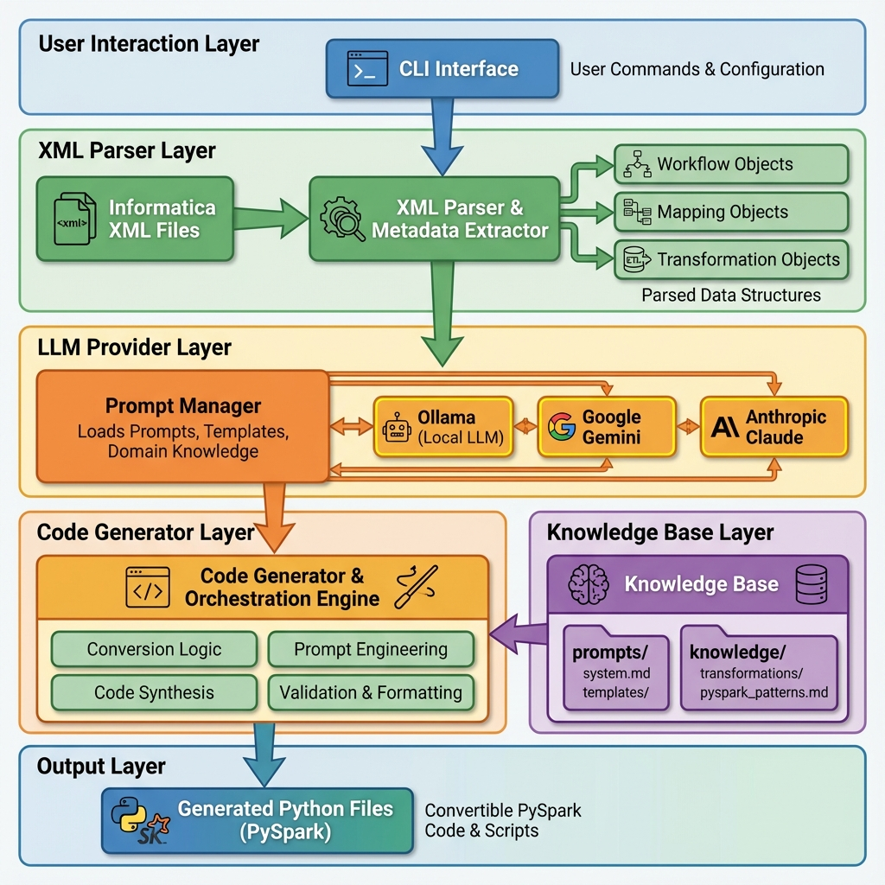
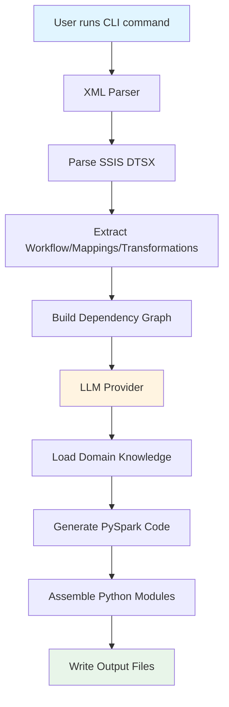
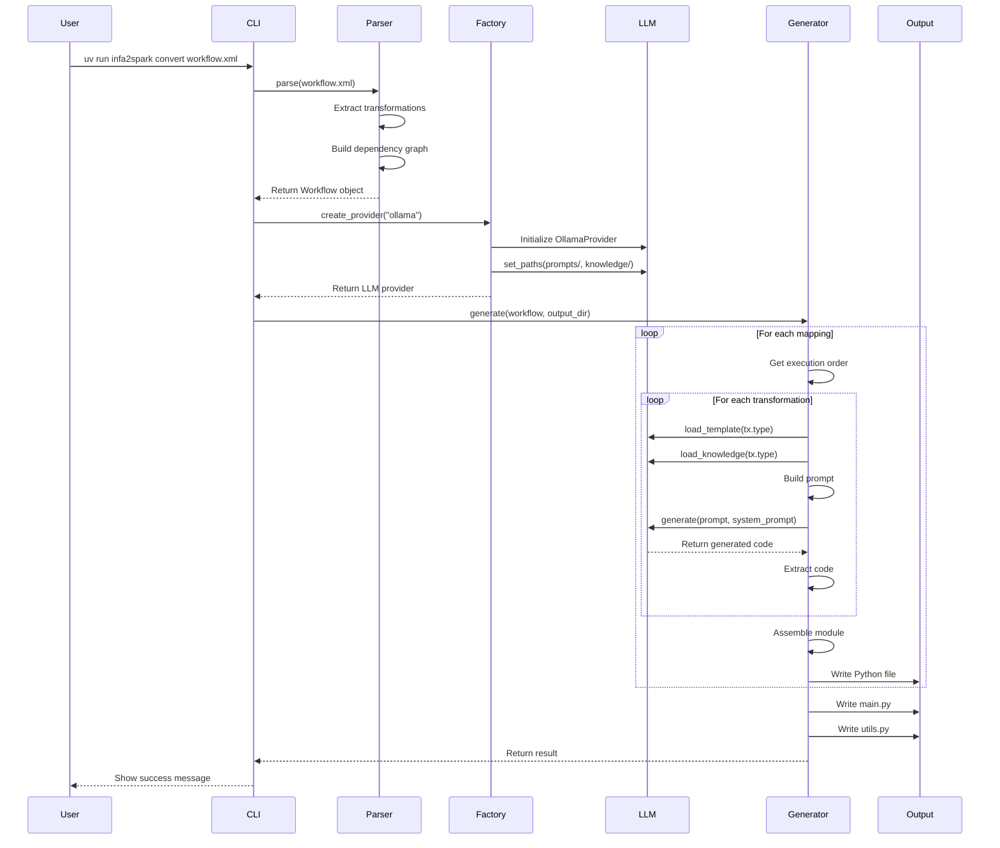

# SSIS to PySpark Conversion - Codebase Overview

This document explains how the SSIS to PySpark conversion tool works, the architecture, and how different components are linked together.

---

## 🎯 What This Tool Does

This tool **converts SSIS ETL packages to PySpark code** using Large Language Models (LLMs). Instead of manual conversion, it:

1. **Parses** SSIS DTSX packages
2. **Understands** transformation logic using domain knowledge
3. **Generates** production-ready PySpark code via LLMs
4. **Assembles** complete Python modules with proper structure

---

## 🏗️ High-Level Architecture



### Detailed Flow



---

## 📂 Project Structure

```
├── src/                          # Core application code
│   ├── cli.py                    # Command-line interface (entry point)
│   ├── config.py                 # Configuration management
│   ├── parsers/                  # XML parsing layer
│   │   └── informatica_xml.py    # Parses SSIS DTSX packages into Python Objects
│   ├── llm/                      # LLM integration layer
│   │   ├── base.py               # Abstract base class for providers
│   │   ├── factory.py            # Creates LLM provider instances
│   │   ├── azure_openai_provider.py # Azure OpenAI integration
│   │   └── ... (Ollama, Gemini, Anthropic providers)
│   └── generators/               # Generation layer
│       ├── pyspark_output.py     # Generates PySpark code & metadata
│       ├── pyspark_unit_tests.py # Generates PyTest cases
│       ├── business_logic_docs.py # Generates logic documentation
│       └── conversion_log.py     # Generates KT/Conversion log
├── docs/                         # Project documentation
│   └── codebase_overview.md      # This file
├── knowledge/                    # Domain knowledge for LLM
│   ├── pyspark_patterns.md       # Target code best practices
│   ├── type_mappings.yaml        # SSIS -> PySpark type map
│   └── transformations/          # Transformation-specific templates
│       ├── aggregator.md
│       ├── joiner.md
│       └── ... (13 files total)
└── output/                       # Generated artifacts (Code, Docs, Tests)
```

---

## 🔄 Complete Code Flow

### Step 1: User Invokes CLI

**File**: [`cli.py`](file:///c:/Users/AKaushik/code/agents/infapctopyspark/src/cli.py)

```python
# User runs: uv run infa2spark convert workflow.xml -o output/
@app.command()
def convert(input_file: Path, output_dir: Path, provider: str):
    # 1. Parse XML
    parser = SSISParser()
    workflow = parser.parse(input_file)
    
    # 2. Create LLM provider
    llm = create_provider(provider=provider)
    
    # 3. Step-by-Step Generation
    # Phase A: PySpark Code (Generates main.py, utils.py, mapping_name.py)
    code_gen = PySparkGenerator(llm_provider=llm)
    code_result = code_gen.generate(workflow, output_dir)
    
    # Phase B: Unit Tests (Generates test/test_mapping_name.py)
    test_gen = PySparkUnitTests(llm_provider=llm)
    test_result = test_gen.generate(workflow, output_dir)
    
    # Phase C: Documentation (Generates doc/mapping_name_logic.md)
    doc_gen = BusinessLogicDocGenerator(llm_provider=llm)
    doc_result = doc_gen.generate(workflow, output_dir)
    
    # Phase D: Conversion Log (KT Document based on collected metadata)
    log_gen = ConversionLogGenerator(llm_provider=llm)
    log_result = log_gen.generate(workflow, code_result.metadata, output_dir)
```

**What happens**: The CLI is the entry point. It orchestrates the three main phases: parsing, LLM setup, and code generation.

---

### Step 2: Parse SSIS DTSX

**File**: [`parsers/ssis_dtsx.py`](file:///c:/Users/AKaushik/code/agents/infapctopyspark/src/parsers/ssis_dtsx.py)

#### Key Classes:

```python
@dataclass
class TransformField:
    """Represents a field/port in a transformation"""
    name: str
    datatype: str
    expression: str  # For Expression transformations
    port_type: str   # INPUT/OUTPUT/VARIABLE

@dataclass
class Transformation:
    """Represents an SSIS transformation"""
    name: str
    type: str        # e.g., "Source Qualifier", "Expression", "Filter"
    fields: list[TransformField]
    properties: dict[str, str]
    
@dataclass
class Mapping:
    """Represents an SSIS Data Flow Task"""
    name: str
    transformations: list[Transformation]
    connectors: list[Connector]  # Links between transformations
    
    def get_execution_order(self):
        """Returns transformations in dependency order"""
        # Builds a dependency graph and returns topologically sorted list

@dataclass
class Source:
    name: str
    datatype: str
    fields: list[SourceField]

@dataclass
class Workflow:
    """Top-level structure containing all mappings"""
    name: str
    mappings: list[Mapping]
    sources: list[Source]
    targets: list[Target]
```

#### Parsing Process:

```python
class SSISParser:
    def parse(self, xml_path: Path) -> Workflow:
        # 1. Load XML file
        tree = etree.parse(xml_path)
        root = tree.getroot()
        
        # 2. Detect format (POWERMART/REPOSITORY)
        if root.tag == "POWERMART":
            return self._parse_repository_export(root)
        
        # 3. Extract mappings
        for mapping_elem in root.findall(".//MAPPING"):
            mapping = self._parse_mapping(mapping_elem)
            
        # 4. Extract transformations
        for tx_elem in mapping_elem.findall(".//TRANSFORMATION"):
            tx = self._parse_transformation(tx_elem)
            
        # 5. Build dependency graph from connectors
        mapping.get_execution_order()  # Topological sort
```

**What happens**: The parser reads the XML file, extracts all transformations, fields, and connections, then builds a dependency graph to determine execution order.

---

### Step 3: Create LLM Provider

**File**: [`llm/factory.py`](file:///c:/Users/AKaushik/code/agents/infapctopyspark/src/llm/factory.py)

```python
def create_provider(provider: str = None) -> BaseLLMProvider:
    config = get_config()
    provider = provider or config.llm.provider  # Default from config
    
    # Find paths for prompts and knowledge
    prompts_dir = project_root / "prompts"
    knowledge_dir = project_root / "knowledge"
    
    if provider == "ollama":
        llm = OllamaProvider(
            model=config.llm.ollama.model,
            base_url="http://localhost:11434",
        )
    elif provider == "gemini":
        llm = GeminiProvider(
            model=config.llm.gemini.model,
            api_key=config.google_api_key,
        )
    # ... similar for anthropic
    
    # Set paths so LLM can load prompts/knowledge
    llm.set_paths(prompts_dir, knowledge_dir)
    
    return llm
```

**File**: [`llm/base.py`](file:///c:/Users/AKaushik/code/agents/infapctopyspark/src/llm/base.py)

```python
class BaseLLMProvider(ABC):
    """Abstract base class all providers implement"""
    
    def set_paths(self, prompts_dir: Path, knowledge_dir: Path):
        self._prompts_dir = prompts_dir
        self._knowledge_dir = knowledge_dir
    
    def load_prompt(self, filename: str) -> str:
        """Load system.md or transformation_rules.md"""
        return (self._prompts_dir / filename).read_text()
    
    def load_template(self, transformation_type: str) -> str:
        """Load templates/expression.md, templates/filter.md, etc."""
        filename = f"{transformation_type.lower()}.md"
        return (self._prompts_dir / "templates" / filename).read_text()
    
    def load_knowledge(self, filename: str) -> str:
        """Load knowledge/transformations/aggregator.md, etc."""
        return (self._knowledge_dir / filename).read_text()
    
    @abstractmethod
    def generate(self, prompt: str, system_prompt: str) -> LLMResponse:
        """Each provider implements this to call their LLM"""
        pass
```

**What happens**: The factory creates the appropriate LLM provider (Ollama, Gemini, or Anthropic) and gives it access to prompts and knowledge files.

---

### Step 4: Generate PySpark Code

**File**: [`generators/pyspark_output.py`](file:///c:/Users/AKaushik/code/agents/infapctopyspark/src/generators/pyspark_output.py)

This is the **core orchestrator** that ties everything together.

#### Main Generation Flow:

```python
class PySparkGenerator:
    def __init__(self, llm_provider: BaseLLMProvider):
        self.llm = llm_provider
        
    def generate(self, workflow: Workflow, output_dir: Path):
        """Generate PySpark for entire workflow"""
        result = GenerationResult(success=True)
        
        # For each mapping in the workflow
        for mapping in workflow.mappings:
            path, metadata = self._generate_mapping(mapping, output_dir)
            result.metadata.extend(metadata) # Collect notes for KT doc
        
        # ... generate main.py and utils.py ...
        return result
```

#### Per-Mapping Generation:

```python
def _generate_mapping(self, mapping: Mapping, output_dir: Path):
    """Generate PySpark code for a single mapping"""
    
    # Get transformations in execution order (dependency-sorted)
    transformations = mapping.get_execution_order()
    
    code_blocks = []
    
    # Generate code for each transformation
    for tx in transformations:
        code = self._generate_transformation(tx, mapping)
        code_blocks.append(code)
    
    # Assemble into a Python module
    module_code = self._assemble_module(
        mapping.name, 
        code_blocks, 
        mapping
    )
    
    # Write to file
    filename = self._sanitize_filename(mapping.name) + ".py"
    (output_dir / filename).write_text(module_code)
```

#### Per-Transformation Generation (The Magic):

```python
def _generate_transformation(self, tx: Transformation, mapping: Mapping):
    """Generate PySpark code for a single transformation using LLM"""
    
    # 1. Load transformation-specific template
    template = self.llm.load_template(tx.type)
    # e.g., loads prompts/templates/expression.md
    
    # 2. Load domain knowledge
    knowledge_file = f"transformations/{tx.type.lower()}.md"
    knowledge = self.llm.load_knowledge(knowledge_file)
    # e.g., loads knowledge/transformations/expression.md
    
    # 3. Load general PySpark patterns
    patterns = self.llm.load_knowledge("pyspark_patterns.md")
    
    # 4. Build context about upstream transformations
    context = self._build_context(tx, mapping)
    
    # 5. Assemble the complete prompt
    prompt = self._assemble_prompt(
        transformation=tx,
        template=template,
        type_mappings=knowledge,
        pyspark_patterns=patterns,
        context=context
    )
    
    # 6. Load system prompt
    system_prompt = self.llm.load_prompt("system.md")
    
    # 7. Call LLM to generate code
    response = self.llm.generate(prompt, system_prompt)
    
    # 8. Extract code from response
    code = self.llm.extract_code(response.text)
    
    return code
```

#### Prompt Assembly:

```python
def _assemble_prompt(self, transformation, template, type_mappings, 
                     pyspark_patterns, context):
    """Build the complete prompt for the LLM"""
    
    # Convert transformation to JSON for the LLM
    tx_json = json.dumps({
        "name": transformation.name,
        "type": transformation.type,
        "fields": [
            {
                "name": f.name,
                "datatype": f.datatype,
                "expression": f.expression,
                "port_type": f.port_type
            }
            for f in transformation.fields
        ],
        "properties": transformation.properties
    }, indent=2)
    
    # Assemble prompt with all context and "Conversion Notes" requirement
    prompt = f"""
# Transformation Metadata (JSON)
{tx_json}

# Domain Knowledge & Patterns
{type_mappings}
{pyspark_patterns}

# Conversion Notes Requirement
Please provide:
1. Optimizations Applied: Any improvements over original INFA logic.
2. Review Notes: Parts requiring engineer validation.
3. Complexity Note: Low/Medium/High.

# Task
Generate production-ready PySpark code block.
"""
    
    return prompt
```

**What happens**: For each transformation, the generator:
1. Loads transformation-specific templates and knowledge
2. Builds context about upstream transformations
3. Assembles a comprehensive prompt with all information
4. Calls the LLM to generate PySpark code
5. Extracts and validates the generated code

---

## 🔗 How Components Are Linked

### Data Flow Diagram



---

## 📋 Key Files and Their Roles

| File | Role | Links To |
|------|------|----------|
| [`cli.py`](file:///c:/Users/AKaushik/code/agents/infapctopyspark/src/cli.py) | Entry point, orchestrates workflow | Parser, Factory, Generator |
| [`parsers/ssis_dtsx.py`](file:///c:/Users/AKaushik/code/agents/infapctopyspark/src/parsers/ssis_dtsx.py) | Parses DTSX, builds data structures | Returns to CLI |
| [`llm/factory.py`](file:///c:/Users/AKaushik/code/agents/infapctopyspark/src/llm/factory.py) | Creates LLM provider instances | Base, Ollama/Gemini/Anthropic providers |
| [`llm/base.py`](file:///c:/Users/AKaushik/code/agents/infapctopyspark/src/llm/base.py) | Abstract interface for LLMs | Loads prompts and knowledge |
| [`generators/pyspark_output.py`](file:///c:/Users/AKaushik/code/agents/infapctopyspark/src/generators/pyspark_output.py) | Orchestrates code generation | LLM provider, prompts, knowledge |
| [`prompts/system.md`](file:///c:/Users/AKaushik/code/agents/infapctopyspark/prompts/system.md) | System prompt for LLM | Used by all generations |
| [`prompts/templates/*.md`](file:///c:/Users/AKaushik/code/agents/infapctopyspark/prompts/templates) | Per-transformation templates | Loaded by generator |
| [`knowledge/transformations/*.md`](file:///c:/Users/AKaushik/code/agents/infapctopyspark/knowledge/transformations) | Domain knowledge | Loaded by generator |

---

## 🎓 Domain Knowledge System

The tool uses a **knowledge-based approach** where domain expertise is stored in markdown files:

### System Prompt ([`prompts/system.md`](file:///c:/Users/AKaushik/code/agents/infapctopyspark/prompts/system.md))

Tells the LLM:
- You are an expert data engineer
- Convert to production-ready PySpark
- Use DataFrame API, not RDDs
- Include type hints and comments
- Common function mappings (IIF → when/otherwise, etc.)

### Transformation Templates ([`prompts/templates/`](file:///c:/Users/AKaushik/code/agents/infapctopyspark/prompts/templates))

Provide transformation-specific guidance:
- **expression.md**: How to convert Expression transformations
- **filter.md**: How to convert Filter transformations
- **source_qualifier.md**: How to convert Source Qualifier to spark.read

### Transformation Knowledge ([`knowledge/transformations/`](file:///c:/Users/AKaushik/code/agents/infapctopyspark/knowledge/transformations))

Detailed documentation for each transformation type:
- **aggregator.md**: Aggregator semantics, groupBy patterns
- **joiner.md**: Join types, broadcast hints
- **lookup.md**: Connected vs unconnected lookups

---

## 💡 Example: Converting an Expression Transformation

Let's trace how an Expression transformation gets converted:

### 1. Input XML (Simplified)

```xml
<TRANSFORMATION NAME="exp_Calculate" TYPE="Expression">
  <TRANSFORMFIELD NAME="CUSTOMER_ID" DATATYPE="integer" PORTTYPE="INPUT"/>
  <TRANSFORMFIELD NAME="FIRST_NAME" DATATYPE="string" PORTTYPE="INPUT"/>
  <TRANSFORMFIELD NAME="LAST_NAME" DATATYPE="string" PORTTYPE="INPUT"/>
  <TRANSFORMFIELD NAME="FULL_NAME" DATATYPE="string" PORTTYPE="OUTPUT"
                  EXPRESSION="FIRST_NAME || ' ' || LAST_NAME"/>
  <TRANSFORMFIELD NAME="NAME_LENGTH" DATATYPE="integer" PORTTYPE="OUTPUT"
                  EXPRESSION="LENGTH(FULL_NAME)"/>
</TRANSFORMATION>
```

### 2. Parser Output

```python
Transformation(
    name="exp_Calculate",
    type="Expression",
    fields=[
        TransformField(name="CUSTOMER_ID", datatype="integer", port_type="INPUT"),
        TransformField(name="FIRST_NAME", datatype="string", port_type="INPUT"),
        TransformField(name="LAST_NAME", datatype="string", port_type="INPUT"),
        TransformField(name="FULL_NAME", datatype="string", port_type="OUTPUT",
                      expression="FIRST_NAME || ' ' || LAST_NAME"),
        TransformField(name="NAME_LENGTH", datatype="integer", port_type="OUTPUT",
                      expression="LENGTH(FULL_NAME)"),
    ]
)
```

### 3. Prompt Assembly

The generator loads:
- **Template**: `prompts/templates/expression.md`
- **Knowledge**: `knowledge/transformations/expression.md`
- **System**: `prompts/system.md`

And creates a prompt like:

```
# Transformation to Convert
{
  "name": "exp_Calculate",
  "type": "Expression",
  "fields": [
    {"name": "FULL_NAME", "expression": "FIRST_NAME || ' ' || LAST_NAME"},
    {"name": "NAME_LENGTH", "expression": "LENGTH(FULL_NAME)"}
  ]
}

# Domain Knowledge
Expression transformations map to .withColumn() or .select()
- || concatenation → F.concat()
- LENGTH() → F.length()

Generate production-ready PySpark code...
```

### 4. LLM Generation

The LLM generates:

```python
def exp_calculate(input_df: DataFrame) -> DataFrame:
    """
    Calculate full name and name length.
    
    Args:
        input_df: Input DataFrame with CUSTOMER_ID, FIRST_NAME, LAST_NAME
        
    Returns:
        DataFrame with added FULL_NAME and NAME_LENGTH columns
    """
    from pyspark.sql import functions as F
    
    result_df = input_df.withColumn(
        "FULL_NAME",
        F.concat(F.col("FIRST_NAME"), F.lit(" "), F.col("LAST_NAME"))
    ).withColumn(
        "NAME_LENGTH",
        F.length(F.col("FULL_NAME"))
    )
    
    return result_df
```

### 5. Module Assembly

The generator collects all transformation functions and assembles:

```python
# output/customer_mapping.py

from pyspark.sql import DataFrame, SparkSession
from pyspark.sql import functions as F

def sq_customers(spark: SparkSession) -> DataFrame:
    """Source Qualifier: Read customers table"""
    return spark.read.table("customers")

def exp_calculate(input_df: DataFrame) -> DataFrame:
    """Expression: Calculate full name"""
    # ... (generated code)

def flt_active_only(input_df: DataFrame) -> DataFrame:
    """Filter: Active customers only"""
    # ... (generated code)

def main():
    spark = SparkSession.builder.appName("customer_mapping").getOrCreate()
    
    # Execute in dependency order
    df1 = sq_customers(spark)
    df2 = exp_calculate(df1)
    df3 = flt_active_only(df2)
    
    # Write output
    df3.write.mode("overwrite").saveAsTable("customers_processed")

if __name__ == "__main__":
    main()
```

---

## 🔍 Summary

### The Complete Flow:

1. **User runs CLI** → [`cli.py`](file:///c:/Users/AKaushik/code/agents/infapctopyspark/src/cli.py)
2. **Parse XML** → [`parsers/ssis_dtsx.py`](file:///c:/Users/AKaushik/code/agents/infapctopyspark/src/parsers/ssis_dtsx.py) extracts transformations
3. **Create LLM** → [`llm/factory.py`](file:///c:/Users/AKaushik/code/agents/infapctopyspark/src/llm/factory.py) initializes provider
4. **Generate code** → [`generators/pyspark_output.py`](file:///c:/Users/AKaushik/code/agents/infapctopyspark/src/generators/pyspark_output.py):
   - For each transformation in dependency order
   - Load template from [`prompts/templates/`](file:///c:/Users/AKaushik/code/agents/infapctopyspark/prompts/templates)
   - Load knowledge from [`knowledge/transformations/`](file:///c:/Users/AKaushik/code/agents/infapctopyspark/knowledge/transformations)
   - Build prompt with transformation details
   - Call LLM via [`llm/base.py`](file:///c:/Users/AKaushik/code/agents/infapctopyspark/src/llm/base.py) interface
   - Extract generated code
5. **Assemble modules** → Combine functions into Python files
6. **Write output** → Save to `output/` directory

### Key Design Principles:

- **Separation of Concerns**: Parsing, LLM, and generation are separate
- **Knowledge-Driven**: Domain expertise in markdown files, not hardcoded
- **Provider-Agnostic**: Works with Ollama, Gemini, or Anthropic
- **Dependency-Aware**: Respects transformation execution order
- **Production-Ready**: Generated code includes types, docs, and best practices
